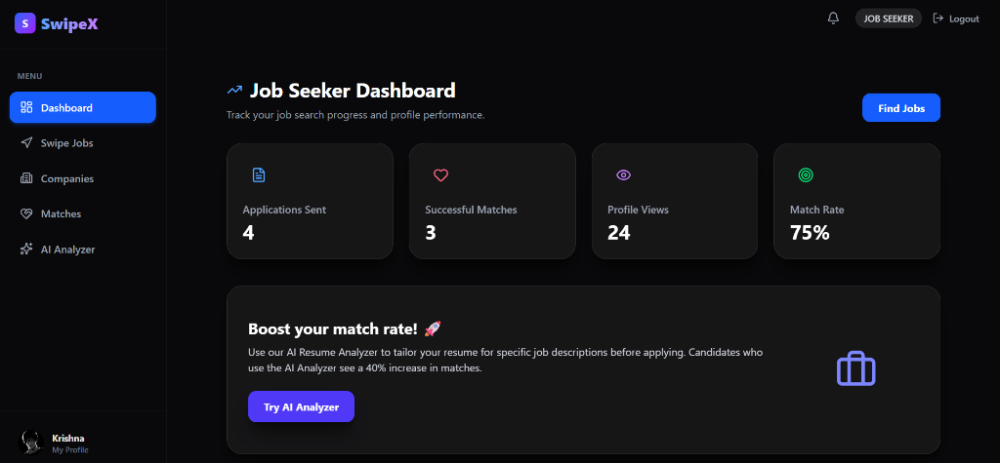
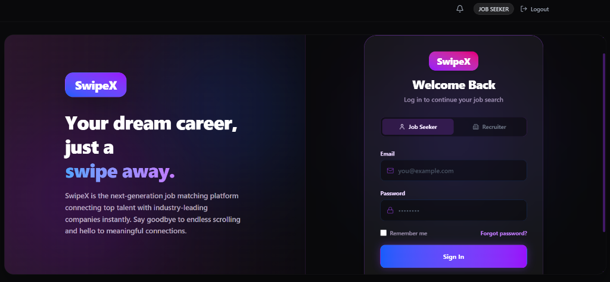
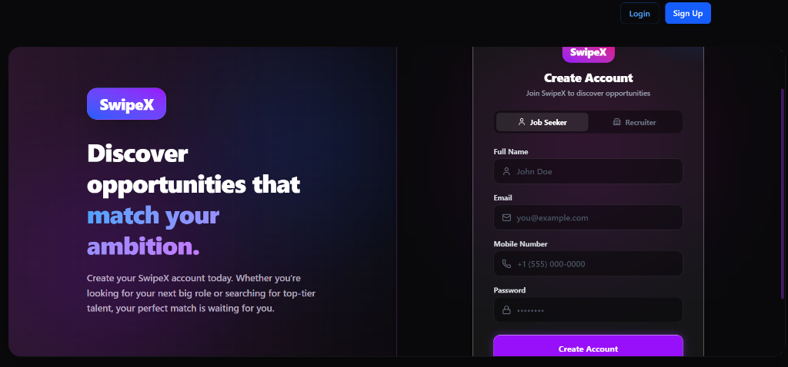
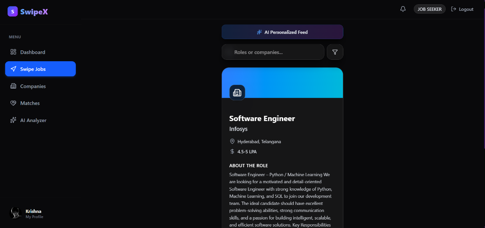
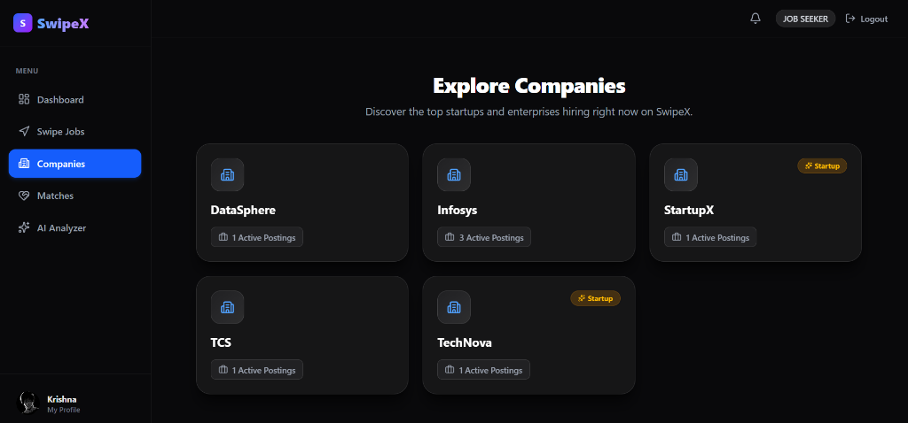
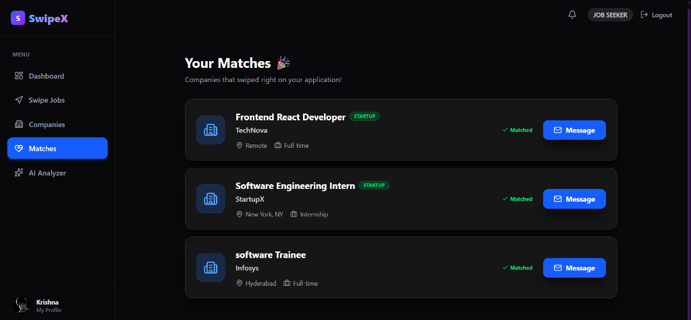
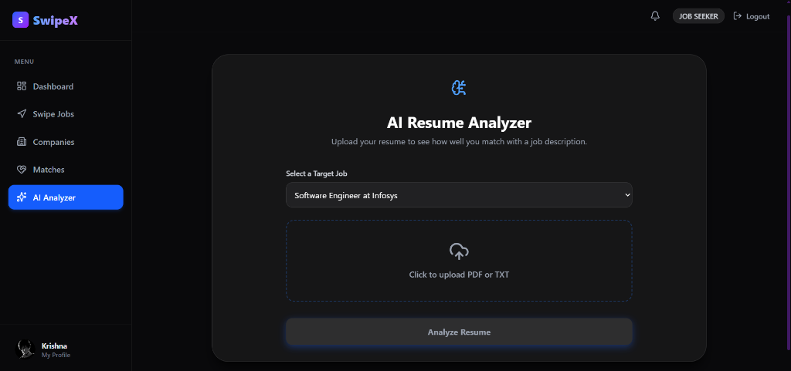
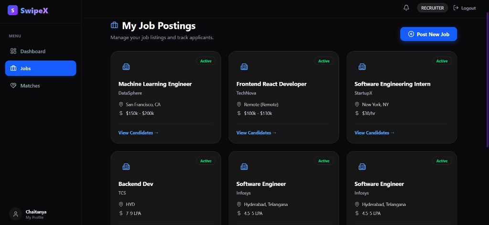
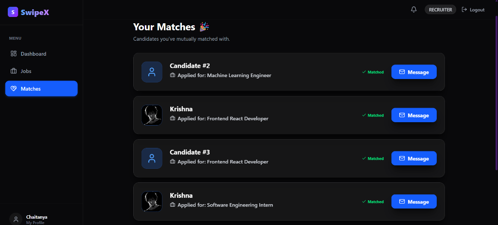
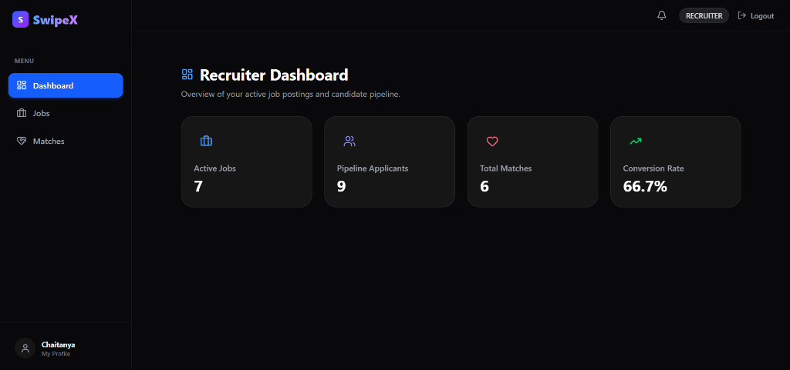

# SwipeX 🚀

SwipeX is an **Intelligent Job Discovery Platform** that brings a modern, Tinder-like swiping experience to job hunting and recruiting. Built with a stunning **Dark Glassmorphism UI**, SwipeX makes finding your next career move—or your next star candidate—fast, intuitive, and beautiful.


## 📸 Screenshots

<div align="center">
  
  
  
  
  
  
  
  
  
  
</div>

## ✨ Features

- **Tinder-like Swiping:** Job seekers can swipe right to apply to jobs and left to pass. Recruiters swipe on candidates.
- **Dual Modes:** Fully featured interfaces for both **Job Seekers** and **Recruiters**.
- **Mutual Matches:** When a recruiter and a job seeker both swipe right, it's a match!
- **Real-Time Chat:** Instantly chat with your matches using the built-in messaging system.
- **AI Resume Analyzer:** Job seekers can upload their resume and get instant AI-powered feedback on how well it matches a job description.
- **Profile Customization:** Upload profile pictures, add your portfolio, and highlight your skills.
- **Advanced Filtering:** Filter the Swipe Feed by Startup/MNC, Remote, Salary Range, and Location.
- **Premium Dark UI:** Carefully crafted glassmorphism design with a `#09090b` base, backdrop blurs, and vibrant accent colors.

## 🛠 Tech Stack

### Frontend
- **React 18** (Vite)
- **Tailwind CSS** (for styling and glassmorphism effects)
- **Framer Motion** (for smooth page transitions and micro-animations)
- **React-Tinder-Card** (for the core swipe mechanics)
- **Lucide React** (beautiful iconography)

### Backend
- **FastAPI** (Python 3)
- **SQLAlchemy** (ORM)
- **SQLite** (Database)
- **JWT Authentication**

---

## 🚀 Getting Started

Follow these steps to get SwipeX running on your local machine.

### 1. Clone the repository
```bash
git clone https://github.com/Chaitanya8822/swipeX.git
cd swipeX
```

### 2. Set up the Backend
```bash
cd backend

# Create and activate a virtual environment (Windows)
python -m venv venv
.\venv\Scripts\Activate.ps1

# (On Mac/Linux: source venv/bin/activate)

# Install dependencies
pip install fastapi uvicorn sqlalchemy passlib[bcrypt] python-jose python-multipart pydantic[email]

# Run the FastAPI server
uvicorn app.main:app --reload --port 8005
```

### 3. Set up the Frontend
Open a new terminal window:
```bash
cd frontend

# Install dependencies
npm install

# Run the Vite development server
npm run dev
```

### 4. Open the App
The frontend is configured to run on a custom port. Open your browser and navigate to:
**[http://localhost:3005](http://localhost:3005)**

*(If Vite defaults to 5173, use `http://localhost:5173` instead).*

---

## 💡 Usage Guide

1. **Sign Up:** Create a new account and choose your role (Job Seeker or Recruiter).
2. **Complete Profile:** Go to the Profile page to upload an avatar, fill in your bio, and add your skills/company info.
3. **Start Swiping:** Head to the Swipe Feed. Recruiters will see candidates, and Job Seekers will see jobs.
4. **Matches & Chat:** Once a mutual match occurs, head to the Matches tab to view it and start a conversation!

---
*SwipeX - Redefining the hiring experience.*
